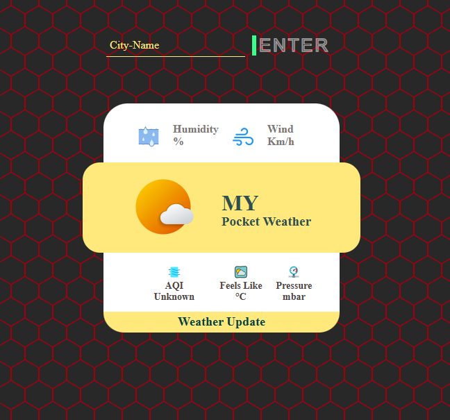
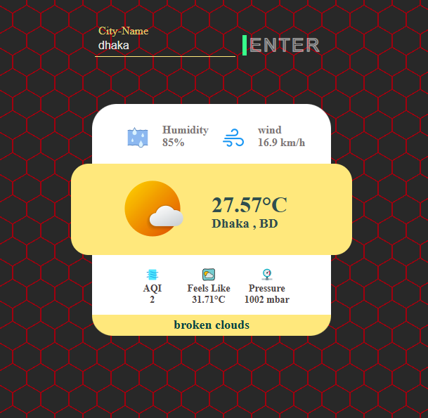

# Pocket Weather 🌤️

A lightweight weather application that provides real-time weather information for any valid city worldwide. Built with simplicity and usability in mind.

## Screenshots 📸

 
*Search for any city*

 
*Detailed weather information* 


## Features ✨
- 🔍 Search any valid city name
- 🌡️ View temperature (Celsius)
- ☁️ Check weather conditions (Scerettered clouds, Broken clouds, etc.)
- 💨 Wind speed and atmospheric pressure
- 💧 Humidity levels
- 🫷 Real-time Air Quality Index

## How to Use 🚀
1. Enter a city name in the search bar
2. click the search button
3. View detailed weather information for your location

## Technologies Used 💻
- Frontend: HTML, CSS, JavaScript
- Weather API: [OpenWeatherMap](https://openweathermap.org/)

## Installation ⚙️
To run locally:
```bash
git clone https://github.com/RobiMankhinStart/Pocket_Weather.git
cd Pocket_Weather
# Open index.html in your browser
Live Demo 🌐
Try Pocket Weather Live!
(Add your live link if deployed)

Contributing 🤝
Contributions are welcome! Please open an issue or submit a pull request.

License 📄
This project is licensed under the MIT License - see the LICENSE file for details.

Acknowledgments 🙏
Thanks to OpenWeatherMap for their weather API
